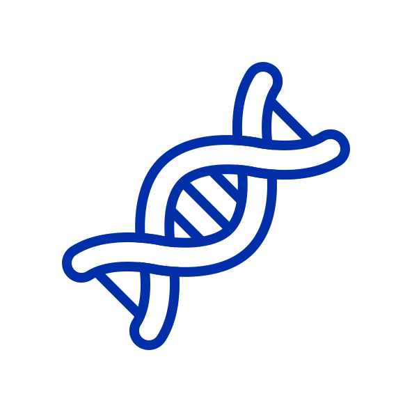

# CassetteAI — Toward safer gene therapies

**Live demo:** [cassetteai.dev](https://cassetteai.dev)

Life science has produced a **lot** of machine learning models, but most of them don't have a user-friendly interface, and this slows adoption. This project is my contribution to this problem. :)

DNA-based drugs are an important category of therapeutics, but getting them to activate in the right tissue, and only that tissue, remains a major challenge. Short DNA sequences called enhancers act as molecular zip codes, telling a gene where and when to turn on.

CassetteAI is a no-code way to design these DNA elements: Just describe the tissue type you'd like to target, and CassetteAI deploys multiple genomics models on serverless GPUs to translate your natural language prompt into tissue-specific enhancers, score them, and present the best ones.

---

<p align="center">
  
</p>

---

## Features

- **Conversational design** — describe your gene therapy goal in plain English and get a complete cassette design back
- **Biological reasoning** — CassetteAI can reason over and explain the data and designs it generates
- **Real generative models** — DNA-Diffusion generates novel 200 bp regulatory elements conditioned on cell type (HepG2, K562, GM12878, hESCT0)
- **Genome-wide scoring** — Sei evaluates each candidate across 21,907 chromatin profiles grouped into 40 tissue/cell-type classes
- **AI interpretation** — Claude Sonnet ranks candidates by tissue specificity, flags sequence pathologies (GC content, homopolymers, cryptic polyA), and recommends a final element
- **Cassette composition** — automatically pairs the top element with a minimal promoter, transgene placeholder, polyA signal, and ITRs, with a size check against the 4.7 kb AAV limit
- **Interactive heatmap** — Tissue-specificity scores are visualized in a clean histogram
- **SVG cassette diagram** — rendered AAV cassette with labeled components and base-pair lengths
- **Streaming UI** — real-time status updates as the pipeline progresses (generating → scoring → analyzing)
- **Chat history** — sidebar with persistent chat sessions, automatic naming, and multi-conversation support

---

## Currently Supported Tissues

| User input | Cell line | Notes |
|-----------|-----------|-------|
| liver / hepatocyte / hepatic | HepG2 | Biologically accurate end-to-end |
| blood / hematopoietic / myeloid | K562 | Myeloid lineage |
| immune / lymphoid / B-cell / T-cell | GM12878 | Lymphoblastoid |
| stem cell / pluripotent / embryonic | hESCT0 | Embryonic stem cell |

For unsupported tissues, CassetteAI explains the limitation and offers the closest available proxy.

---

## Tech Stack

| Layer | Technology |
|-------|-----------|
| Frontend | React 19 + Vite + Tailwind CSS 4 |
| Backend | FastAPI + SSE streaming |
| AI | Claude Sonnet (Anthropic API) |
| DNA generation | DNA-Diffusion (Modal A100) |
| Sequence scoring | Sei (Modal A100) |
| Routing | wouter |
| Charts | Recharts |
| Deployment | Docker → Railway |

---

## Quick Start (Local Development)

### Prerequisites

- Python 3.10+
- Node.js 18+
- [Modal](https://modal.com) account
- Anthropic API key

### Setup

```bash
# Clone
git clone https://github.com/your-org/CassetteAI.git
cd CassetteAI

# Backend
python3 -m venv .venv
source .venv/bin/activate
pip install -r backend/requirements.txt

# Frontend
cd frontend && npm install && cd ..

# Credentials
export ANTHROPIC_API_KEY=sk-ant-...
python3 -m modal setup   # one-time Modal auth
```

### Deploy Modal GPU functions

```bash
modal deploy backend/modal_generate.py
modal deploy backend/modal_score.py
```

### Run

```bash
# Terminal 1 — backend
uvicorn backend.server:app --reload --port 8000

# Terminal 2 — frontend dev server
cd frontend && npm run dev
```

Open http://localhost:5173 and try:

> "Design a liver-specific enhancer for AAV delivery"

### Docker

```bash
docker build -t cassette-ai .
docker run -p 8000:8000 -e ANTHROPIC_API_KEY=sk-ant-... cassette-ai
```
---

## Models

| Model | Purpose | Runtime |
|-------|---------|---------|
| DNA-Diffusion | Generate 200 bp regulatory elements conditioned on cell type | Modal A100 |
| Sei | Score 21,907 chromatin profiles across 40 tissue classes | Modal A100 |
| Claude Sonnet | Parse intent, orchestrate pipeline, interpret results, compose cassette | Anthropic API |
